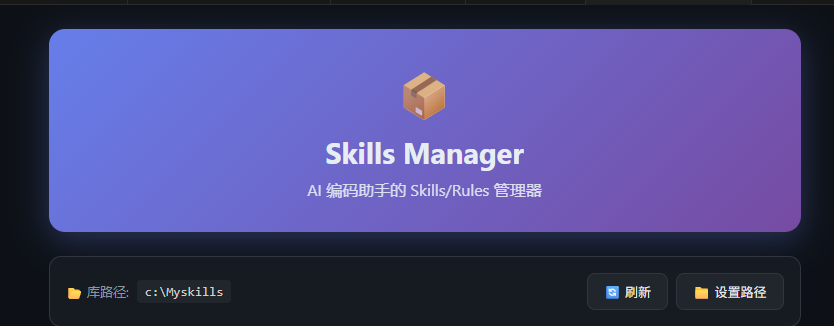
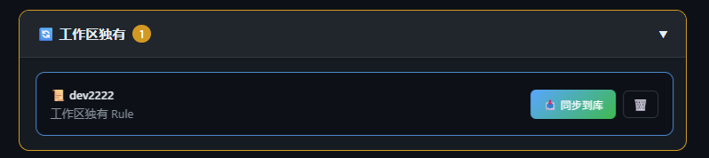
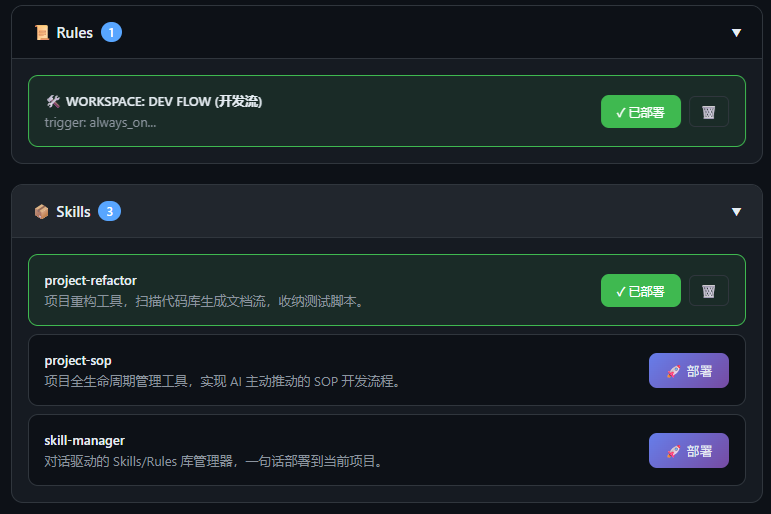

# VS Code Antigravity Skills

> **AI 编码助手的 Skills & Rules 管理器 | Manage and deploy AI Skills & Rules across projects.**

[](https://marketplace.visualstudio.com/items?itemName=chenxuyang.antigravity-skills-manager)
[](LICENSE)
[](https://github.com/chenxuyang/antigravity-skills-manager/stargazers)

VS Code 扩展，用于统一管理、部署和同步 Google Antigravity AI 模型的 Skills (技能) 与 Rules (规则)。

**功能：WebView 仪表盘 · QuickPick 模式 · 双向同步 · 侧边栏视图 · 状态栏入口**

---

## ✨ 功能概览

### 1. WebView 仪表盘


提供可视化的管理界面，支持：
- **卡片式视图**：清晰展示本地库中的所有 Skills 和 Rules。
- **一键部署**：点击部署按钮，立即将 Skill/Rule 应用到当前工作区。
- **状态监控**：实时查看哪些项已部署，哪些项待更新。

### 2. 核心功能：双向同步 (Reverse Sync) 🔥


这是 **Skills Manager** 的核心竞争力。除了从库中部署，我们还支持从工作区同步回库：
- **自动检测**：插件会自动扫描当前工作区的 `.agent/` 目录，识别工作区独有的 Skill/Rule。
- **反向同步**：在 "工作区独有" 区域，点击 **"📥 同步到库"**，即可将临时创建的灵感永久保存到你的标准化技能库中。

### 3. 灵活的显示模式


- **QuickPick 模式**：习惯键盘操作？通过 `Ctrl+Shift+K` 或命令面板快速呼出部署菜单。
- **侧边栏视图**：在 VS Code 侧边栏可以随时查看已部署的项目及其状态。

---

## 🚀 快速开始

### 安装
1. 在 VS Code 市场搜索 `Antigravity Skills Manager` 并安装。
2. 或通过 VSIX 文件安装：`code --install-extension antigravity-skills-manager-x.y.z.vsix`

### 使用
1. **设置库路径**：首次打开，点击面板右上角的 **"📁 设置路径"**，选择你的本地 Skills 库。
2. **部署项**：在仪表盘中找到需要的 Skill，点击 **"🚀 部署"**。
3. **同步灵感**：在项目中新建的 `.md` 规则？稍后在仪表盘中将其同步回库。

---

## 📁 建议库结构

为了获得最佳体验，建议你的本地库采用以下目录结构：

```text
MySkills/
├── .agent/
│   ├── skills/           # 放置自定义技能
│   │   ├── project-sop/
│   │   │   └── SKILL.md
│   │   └── ...
│   └── rules/            # 放置全局或特定规则
│       ├── global.md
│       └── ...
└── README.md
```

---

## ⌨️ 快捷键
- `Ctrl+Shift+K`：打开 Skills Manager 面板 (Mac: `Cmd+Shift+K`)

---

## 🤝 贡献与支持

觉得好用？你的支持是我持续更新的最大动力 ❤️
- ⭐ [GitHub Star](https://github.com/42012606/vscode-antigravity-skills)
- 💬 [提交反馈](https://github.com/42012606/vscode-antigravity-skills/issues)

<a href="docs/SPONSOR.md" target="_blank"></a>

---

## 许可证
MIT

## 免责声明
本项目仅供个人学习和研究使用。使用本项目即表示您同意：
- 不将本项目用于任何商业用途
- 承担使用本项目的所有风险和责任
- 遵守相关服务条款和法律法规
